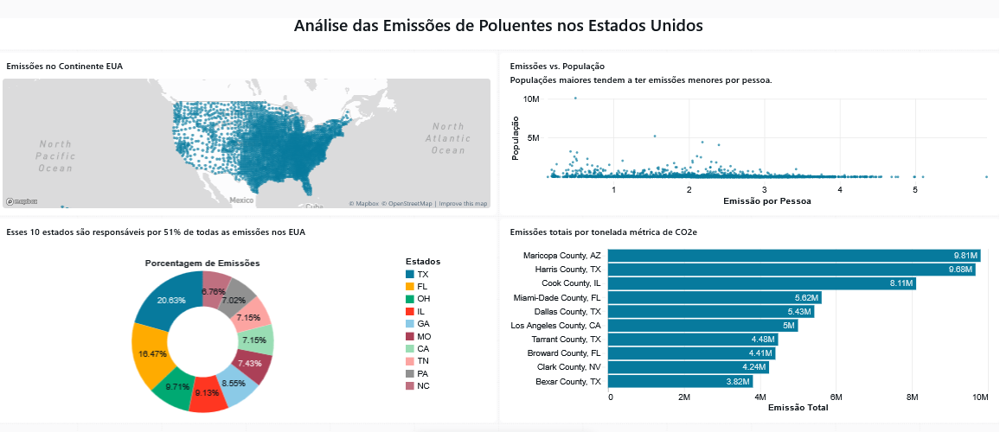

# Análise das Emissões de Poluentes nos Estados Unidos  
## Dashboard Desenvolvido no Databricks

## Visão Geral:

Este projeto apresenta uma análise exploratória e visual das **emissões de poluentes nos Estados Unidos**, utilizando o ambiente **Databricks** para processamento e visualização dos dados.

O objetivo é identificar padrões geográficos, relação entre população e emissão per capita, além de destacar os condados com maior volume total de emissões.

---

---
## Problema de Negócio:

Governos e organizações ambientais precisam responder:

- Quais regiões concentram maiores níveis de emissão?
- A emissão por pessoa varia conforme o tamanho da população?
- Quais estados e condados mais contribuem para a poluição?
- Onde devem ser priorizadas políticas ambientais?

Este dashboard auxilia na análise estratégica desses fatores.

---

## Estrutura do Dashboard:

### 1 Mapa de Emissões nos EUA

Visualização geográfica das emissões distribuídas pelo território americano.

Permite identificar concentração regional de poluentes.

---

### 2 Emissões vs População

Gráfico de dispersão mostrando a relação entre:

- Emissão por pessoa
- População total

Insight:
Estados com maior população tendem a apresentar menor emissão per capita, indicando possíveis ganhos de escala ou maior eficiência energética.

---

### 3 Estados Responsáveis por 51% das Emissões

Gráfico de rosca destacando os 10 estados com maior participação percentual nas emissões totais.

Principais estados identificados:

- TX (Texas)
- FL (Flórida)
- OH (Ohio)
- IL (Illinois)
- GA (Geórgia)
- MO (Missouri)
- CA (Califórnia)
- TN (Tennessee)
- PA (Pensilvânia)
- NC (Carolina do Norte)

---

### 4 Condados com Maior Emissão Total (CO₂e)

Ranking dos principais condados em toneladas métricas de CO₂ equivalente.

Top emissores:

- Maricopa County, AZ
- Harris County, TX
- Cook County, IL
- Miami-Dade County, FL
- Dallas County, TX

---

## Principais Insights:

- As emissões não estão distribuídas uniformemente pelo território.
- Um número reduzido de estados é responsável por grande parte da poluição.
- Grandes centros urbanos concentram altos volumes totais de emissão.
- Existe tendência de menor emissão per capita em estados mais populosos.

---

## Metodologia:

1. Ingestão e tratamento dos dados no Databricks
2. Limpeza e padronização das variáveis
3. Agregação por estado e condado
4. Cálculo de emissão per capita
5. Construção de visualizações estratégicas

---

Link para o Dashboard: https://dbc-6e1acd64-b7cb.cloud.databricks.com/dashboardsv3/01f0efdd756f108584fada601a8312c3/published?o=7474658572149916

---

## Aprendizado:

Este projeto foi desenvolvido acompanhando a aula disponível neste vídeo: https://www.youtube.com/watch?v=CoqZTt528ew.
Ao longo do projeto, aprofundei meus conhecimentos em conceitos e técnicas importantes 
Recomendo fortemente para quem deseja evoluir seus estudos em Data Analytics e Databricks.

